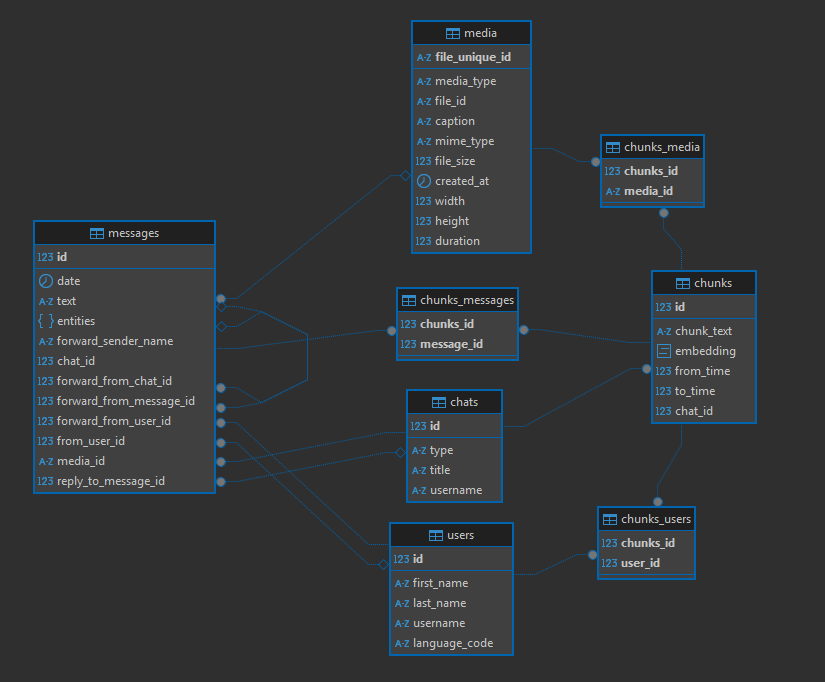

# 🧠 Telegram Chatbot with Embeddings and Context Memory

This bot is built using `aiogram`, `Tortoise ORM`, `LangChain`, and `pgvector`.
It stores all messages, media, and metadata from Telegram chats, creates chunks (contextual blocks), generates embeddings for semantic search, and responds to messages based on previous context.

---

## 📦 Technologies

- [aiogram](https://docs.aiogram.dev/) — Async Telegram bot framework
- [Tortoise ORM](https://tortoise-orm.readthedocs.io/) — Async Python ORM
- [PostgreSQL](https://www.postgresql.org/) + [pgvector](https://github.com/pgvector/pgvector) — Storage for message embeddings
- [LangChain](https://python.langchain.com/) — LLM integration and semantic search
- OpenAI or other embedding model

---


## 🚀 Getting Started

### 1. Clone the repository

```bash
git clone https://github.com/viannik/memoria-tg-bot.git
cd memoria-tg-bot
```

### 2. Install dependencies

```bash
pip install -r requirements.txt
```

### 3. Configure environment

Copy `.env.example` to `.env` and fill in your credentials:

```bash
cp .env.example .env
```

### 4. Run migrations

If using Aerich:

```bash
aerich upgrade
```

Or let the bot auto-generate the schema on first run.

### 5. Start the bot

```bash
python -m app.bot
```

---

## 🗃️ Database Schema



---

## 🧪 Testing

```bash
pytest
```

---

## 🤝 Contributing

Pull requests are welcome! For major changes, please open an issue first to discuss what you would like to change.
